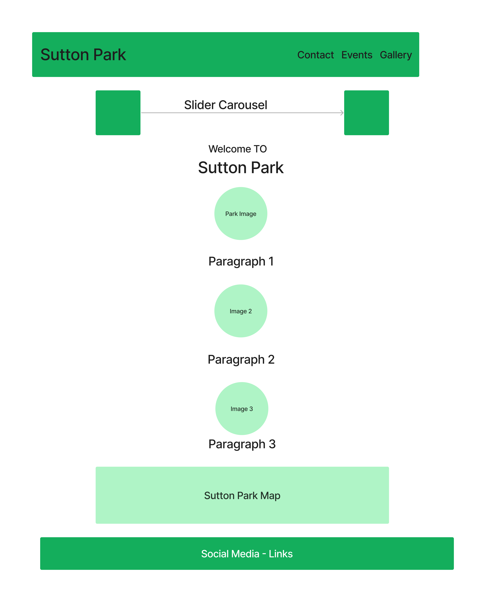

# Sutton-Park

## Milestone Project 1: Static Front-End Website 

 

Sutton Park, is one of the largest nature reserves in the UK/Europe, located in the West Midlands. The aim of the website is to give potential visitors a glimpse of the beauty of the park, and obtain information about the opening times, restaurants and nature and activities located in the park.  

 

This is my Milestone project 1 submission for Code Institute’s Diploma in Web Application Development course. My Website features six pages and is built using languages that I have learnt including, HTML, CSS, JAVA, and Bootstrap.  

 

## Live Project 

 

(Link to the project here)
https://killol14.github.io/the-sutton-park/

 

## Repository  

(Project repository here)  
https://github.com/Killol14/the-sutton-park
 

## Table of Contents  

* User Experience

1.User stories

* Wireframes 

* Design  

1.Font Style  

2.Colour Scheme  

3.Images and Icons  

* Structure  

1.Navigation Bar  

2.Carousel  

3.Hyperlinks  

4.Map  

5.Back to top Buttons  

6.Social Media Links (Footer)  

* Features  

1.Current Features 

* Technologies Used  

1.Languages used  

2.Frameworks and Library Programs  

* Testing  

* Deployment  

1. GitHub Pages  

* Credits  

1.Code  

2.Media  

3.Content  

4.Acknowledgements  

* Summary  
---------------------------------------------------------------------------------------------------

## User Experience

* User Stories

Pspective visitors 

I created this website for families and potential visitors to the park, as I couldn’t find a website that contained both, park information and images in one easy to use and navigate website. 

I believe visitors would like to see the events happening at the park, as well as where are the restaurants, entrances, car park and playgrounds are located.  

I also believe that visitors who wish to ask more questions about the park and the amenities can do so, as I have created a contact form to submit with any questions.  

## Wireframes  

 

## Design 

For the Main title page of The Sutton Park website, (H1) I used Ubuntu as the main font. This is a clear and simplistic font enabling Viewers of the website see clearly the topic of the website.  

The main text in the website is formatted using Montserrat- Bold. Again, this is a visually striking text that is simplistic and enables the reader to navigate the website easily.  

 

## Colour Scheme  

Used RGB throughout.  

I chose this colour scheme, as the website is based around Nature, the Green and beige colour scheme match with the nature tones of the topic of the website.  

* #365832
* #3f6963
* beige
* darkcyan
* rgb(207, 226, 30)
* rgb(63, 90, 81)

## Images  

As this website is based on an area of Natural Beauty, I have included images of the park in order to show the diverse aesthetic of the park.  

The front page has carousel images in order to give a snapshot of the park.  

I have also added extra pictures to each subheading on the website to give a visualization of the attractions situated in the park.  

The website contains border radius throughout for the images to make them more striking and visually appealing 

I have also added a link to a gallery section, in order to give the reader more of an idea of the beauty of the park.  

 

## Icons  

I used the social media on the footer Icons, which are located on the footer from, Font Awesome.  

 

## Structure  

 

### Navigation Bar  

The navigation bar is Static and is sticky, so the user can refer back to the links at the top at any point.  

I have added the navigation bar on the gallery page in order to provide the reader with more information, eg Park Map, Events, Contact, without having to press the back key 

### Carousel 

For the carousel image I have used the Bootstrap 4.5 and 7  

### Hyperlinks  

I have included Hyperlinks on the webpage to allow the user to go straight to different websites where external companies provide more details about the events/restaurants/Opening times to get more information.  

### Map  

I have included a Map, for information on location and also to show the scale of the park.  

 

#### Back to top Buttons  

This is an extra feature, enabling the user to be able to click to go back to the top of the website instead of having to scroll.  

This Idea was sourced from an online website 

 

### Social Media Links (Footer) 

This includes the icons which take the user to the relevant social media page  

This code was sourced from Code Institute’s Bootstrap CV project 

 

 ## Features  

 

### Current Features  

I have created a website that is fully responsive on all screen sizes eg Tablet Mobile Laptop, by using the Bootsrap grid system. This allows the texts and images to translate properly on these devices.  

 

### Interactive Elements  

I have included a hover function on the gallery tab to enable users to zoom in on the pictures.  

I have also added a Map to the bottom page of the website in order for uses to see the scale of the park and the different car parks/entrances and location.  

 

## Technologies Used  

### Languages used 

* HTML 5 and CSS 3  

### Frameworks and Library Programs 

Bootstrap 5  

I used Bootstrap for the Navigation Bar and Carousel 

 

####  Google Fonts 

Two fonts Ubantu and Monserrat Bold, were imported from google font.  

 

####  Font awesome 

I used the social media icons from font awesome  

 

####  Git  

Git was used as version control in terminal  

 

####  Github 

Github was used to create and store the project repository  

 

####  Gitpod  

Gitpod was used to create my files and where I wrote the code.  

 

* JQuery  

JQuery came with Bootstrap to make the Nav bar responsive  

 

### Testing 

####Test Scenario :-
--------------------------------
 |What To Test |Test Step |Result |Expectations |Bug |
 |-------------|----------|-------|-------------|----|
 | Visitor to the website wants visit the website| Open the webpage via the URL Github| The webpage opens normally, in under 3 seconds of fully loaded content.      |  Github link worked and website loads as expected quickly.| No Bug detected.|
 | Visitor wants to know what the page is about| 1. Open the URL Link 2. Photos of the Park and name of the park are in the feature position of the beginning of the website.| Carousel slides showing different pictures after every 5 seconds.Scrolling down there are More pictures and a description of the park and an overview of all the features here.Further down, there are more detailed descriptions of each of the features of the park. With hyperlinks to take the user to the correct page with more detail on that topic.All hyperlinks tested and are working.| A Detailed visionary website that is clear to the user what the topic is about| No Bug Detected|
| Navigation Bar Header| 1. The main header is hovered and when clicked, takes the user to the google map extract of the Sutton park map.| The header link works and takes the user to the map which is also interactive and can be moved to show different areas of the park and also to Google Maps website itself |The user didn’t expect the header to take them to the Map or be a link at all, and thought this was a good feature.| No Bug Detected|
|Navigation Bar Links (Opening times)| Opening times link, takes the user to Birmingham city council webpage, where it details the open ing hours | The Link works to the council website and the opening times can be viewed as the link is the correct link the council page.| For a clear view of the opening times of the park.| No Bug Detected|
| Navigation Bar Links(Contact form)|1. The link takes the user to a separate page, where the user can input contact details and a message.| There is a details tab which has a drop-down arrow, in which the user can find the contact details of the content creator.| As expected, to work without any bugs| No Bug Detected|
|Navigation Bar Links(Events)| 2. The link on the Nav bar takes the user to the Birmingham city council website events page.| The link is working correctly and take the user to the correct page.| As expected, to work without any bugs| No Bug Detected|
| Navigation Bar Links(Gallery)| 3. Pressing the link takes the user to the Gallery page of the website.| The link works and takes the user to the park images page. there is a hover over all the photos, which zooms out the image. The photos also gives the user a snapshot of the beauty of the park.| As expected, to work without any bugs| No Bug Detected|
| Restaurant Hyperlink| 1.Under the sub heading restaurants, there is a hyperlink to the available at the park.         |The hyperlink is detailed in a separate colour, which is obvious to the user to be able to click on this. The link also takes the user to the Google results page detailing the restaurants and links| As expected, to work without any bugs| No Bug Detected|
| Map Hyperlink| 1. At the bottom of the page there is a Snapshot of the park on Google maps. This is an interactive map, in which the user can pull the image down/across etc in order to view different areas of the park.| The Hyperlink works and takes the user to google maps. The interactive feature in the website also works and is able to move within the website itself.| As expected, to work without any bugs| No Bug Detected|
| Back to top button| 1. Pressing the back to top button.| Once pressed the page returns to the top.| As expected, to work without any bugs| No Bug Detected|
| Social Media links| 1. There are 4 social media links, Facebook, Linkedin, Instagram and twitter.Once pressed these take you to the relevant social media pages.| All links work and take to the relevant social media page| As expected, to work without any bugs| No Bug Detected|

### Html, css and LightHouse Testing Reports

 
 
 

## Deployment  

### How this Project was Deployed

This project was deployed to GitHub pages via the following steps:

1.Log into GitHub.![Link to Github] (https://github.com/github)
2.From the list of Repositories, select (Killol14/the-sutton-park.)
3.From the Repositories sub-headings, select "Settings".
4.Under "Options", the first category of settings, scroll down to the GitHub Pages section.
5.From the dropdown list under the "Source" heading, select "master".
6.A second drop-down menu that appears should remain as the default value, "/root".
7.Press Save.
8.On Page refresh, scroll back down to the GitHub Pages section, and the link to the deployed site will be available in a green sub-section with a tick icon next to it.

As this project was developed on the master branch, all changes made to the repository are immediately reflected in the deployed project.

### How to Run this Project in your Browser

1.Install the Google Chrome or Firefox browser.
2.Install the applicable GitPod Browser Extensions for your chosen browser.
3.Create a GitHub account.
4.Log in to Gitpod using your GitHub account.
5.Visit Hard Driver's GitHub Repository.
6.Open the repository in Gitpod:
* Click the green "Gitpod" icon at the top of the Repository, or
* Click this link.
7.A new workspace will open with the current state of the master branch. Any changes made to the master branch after this point will not be automatically updated in your Gitpod Workspace.

### How to Run this Project Locally
--------------------------------------------------
##### Cloning the Repository

1.Visit Hard Driver's GitHub Repository.
2.Click the "Code" dropdown box above the repository's file explorer.
3.Under the "Clone" heading, click the "HTTPS" sub-heading.
4.Click the clipboard icon, or manually copy the text presented: (https://github.com/Killol14/the-sutton-park.git)
5.Open your preferred IDE (VSCode, Atom, PyCharm, etc).
6.Ensure your IDE has support for Git, or has the relevant Git extension.
7.Open the terminal, and create a directory where you would like the Repository to be stored.
8.Type git clone and paste the previously copied text (https://https://github.com/Killol14/the-sutton-park.git) and press enter.
9.The Repository will then be cloned to your selected directory.

### Manually Downloading the Repository

1.Visit Hard Driver's GitHub Repository.
2.Click the "Code" dropdown box above the repository's file explorer.
3.Click the "Download ZIP" option; this will download a copy of the selected branch's repository as a zip file.
4.Locate the ZIP file downloaded to your computer, and extract the ZIP to a designated folder which you would like the repository to be stored.

### Opening the Repository

1.Open your preferred IDE (VSCode, Atom, PyCharm, etc).
2.Navigate to the chosen directory where the Repository was Cloned/Extracted.
3.You will now have offline access to the contents of the project.
 

## Summary 

This website was created as, I noticed when researching ideas for this project, that there was no specific website dedicated to the park. Only the pages on the Birmingham City Council Website were the only information I could find; however, this was just text and no pictures and not overly informative.  

I believe I have a created a website that shows the natural beauty of the park, with stunning visual imagery and links to activities, nature and restaurants.  

 

## Credits  

 

Credit goes to Bootstrap 5 and Shutterstock  
Navigation Bar and carasol are used by Bootstrap 
Main Images from Shutterstock

##### Acknowledgements

 

With thanks to Ronan McCelland,mentor, and Ben Smith, tutor who helped me develop this idea

 

Thank you to the code institute city of Bristol college for help and support.  

 ReadMe file structure, with credit to the former student, milestone 1 Row Gallery Website

This website is purely fictious and not for public consumption.  

 

 

 

 

 

 

 

 

 

 

 

 

 

 

 

 

[def]: https://github.com/github
[def2]: images/LightHouse%20Performance.png
